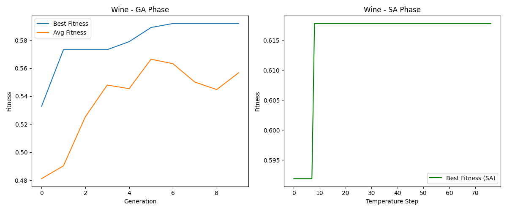
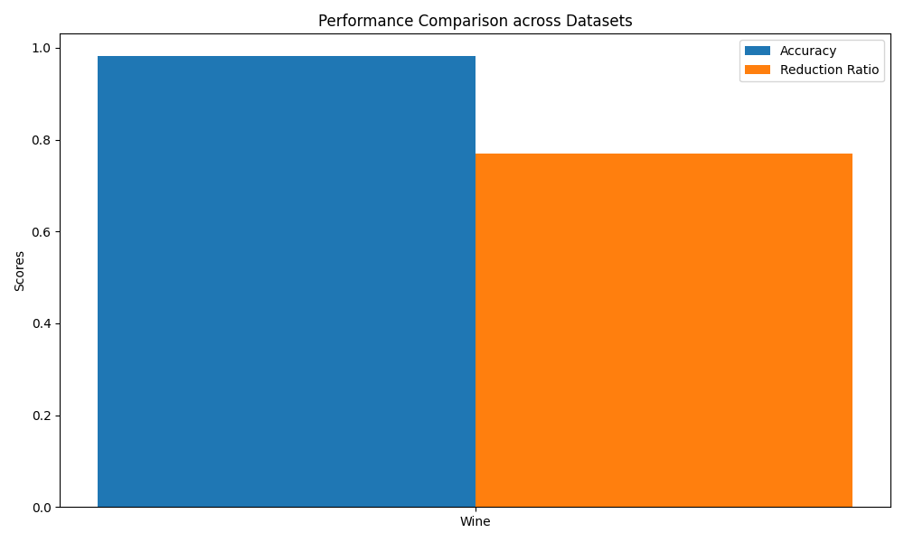
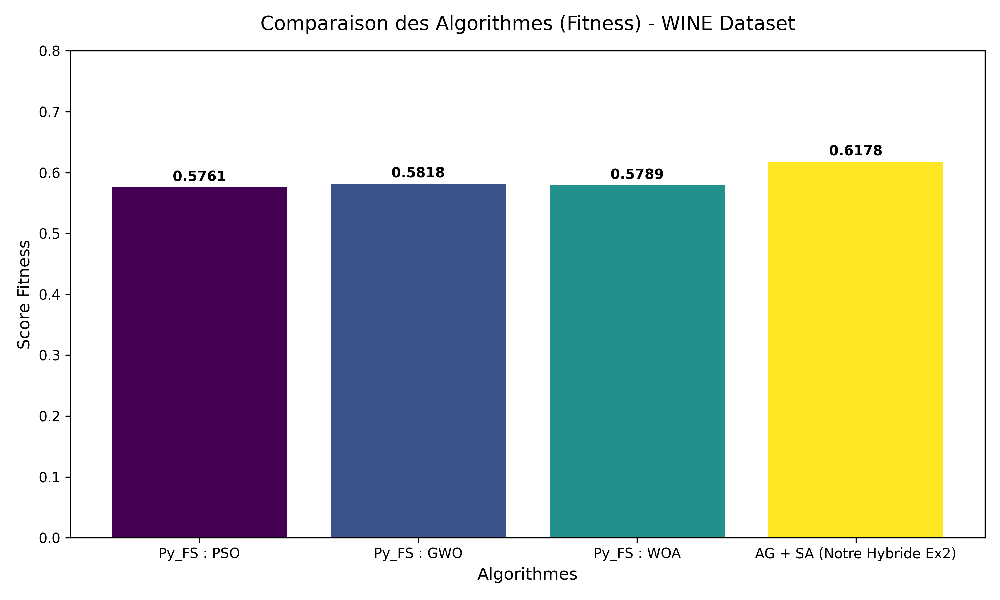
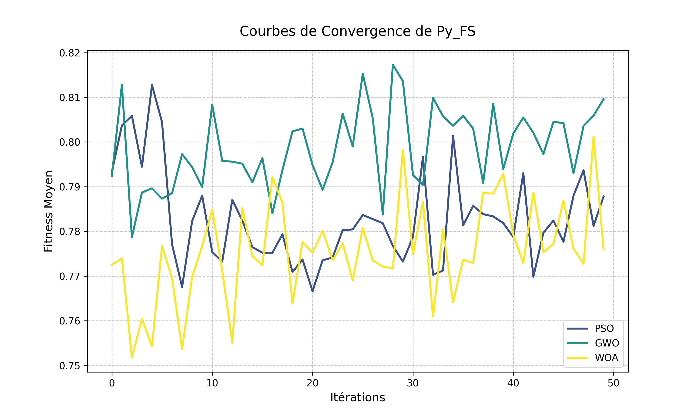

# 🧬 Feature Selection Hybride : Algorithme Génétique & Recuit Simulé


Bienvenue dans ce dépôt ! Ce projet implémente une solution d'optimisation hybride visant à résoudre le problème de **Sélection de Caractéristiques (Feature Selection)**.

Il combine la puissance d'exploration globale d'un **Algorithme Génétique (AG)** avec l'affinement local précis du **Recuit Simulé (Simulated Annealing - SA)**.

## 🎯 Objectifs
- **Maximiser la précision** (Accuracy) d'un modèle de classification (SVM).
- **Minimiser le nombre d'attributs** utilisés (Réduction dimensionnelle).
- Les tests sont effectués sur des jeux de données variés : **Wine**, **Zoo**, **Krvskp** et **Breast Cancer**.

---

## 🧪 Exercice 1 : Algorithme Génétique Binaire (GA Seul)

Cet exercice utilise un **Algorithme Génétique pur** pour la sélection de caractéristiques sur le dataset **Breast Cancer**.

*   **Dataset** : `breast_dataset.csv` (30 features, 569 instances).
*   **Objectif** : Maximiser la précision SVM en minimisant le nombre de caractéristiques sélectionnées.

### 📊 Résultats (GA Seul - Breast Cancer)
Une fois le script `src/8_ga_only_experiment.py` exécuté :
*   **Précision** : ~97-98%
*   **Features** : Réduction massive (souvent moins de 10 features sur 30).
*   **Graphique** : `results/ex1_ga_convergence.png`

---

## 🧪 Exercice 2 : Hybridation AG + SA (Recuit Simulé)

---

## 🏗️ Architecture du Répertoire

Le code a été structuré pour être modulaire et professionnel :

```text
une-solution-hybride-de-Feature-Selection/
│
├── datasets/                 # Placez ici les fichiers .data (wine.data, etc.)
├── results/                  # Dossier de sortie pour les graphiques et CSV
├── guide and archetecture/   # Documentation détaillée et explications du TP
│
└── src/                      # Code source Python (Programmation Orientée Objet)
    ├── config.py                 # Configuration centrale (hyperparamètres)
    ├── 1_data_loading.py         # Nettoyage et normalisation des données
    ├── 2_fitness_function.py     # Évaluation des solutions
    ├── 3_genetic_algorithm.py    # Algorithme Génétique
    ├── 4_simulated_annealing.py  # Recuit Simulé
    ├── 5_hybrid_algorithm.py     # Orchestration de l'hybridation
    ├── 7_main_experiment.py      # Script principal pour générer les résultats
    ├── 8_results_analysis.py     # Génération des graphiques (Matplotlib)
    ├── requirements.txt          # Dépendances du projet
    └── test_quick.py             # Script de test unitaire rapide
```

---

## 🚀 Installation

1. **Cloner le dépôt** :
   ```bash
   git clone https://github.com/VOTRE_NOM/une-solution-hybride-de-Feature-Selection.git
   cd une-solution-hybride-de-Feature-Selection
   ```

2. **Créer et activer un environnement virtuel** (Recommandé) :
   ```bash
   # Sur Windows
   python -m venv tp5
   tp5\Scripts\activate
   
   # Sur Mac/Linux
   python3 -m venv tp5
   source tp5/bin/activate
   ```

3. **Installer les dépendances** :
   ```bash
   cd src
   pip install -r requirements.txt
   ```

---

## 💻 Utilisation

### 1. Test Rapide (Sans données externes)
Pour vérifier que l'installation et l'architecture hybride fonctionnent correctement sur des données factices :
```bash
cd src
python test_quick.py
```

### 2. Expérience Complète
1. Assurez-vous de placer vos fichiers de données (`wine.data`, `zoo.data`, `krvskp.data`) dans le dossier **`datasets/`** à la racine du projet.
2. Lancez l'expérience :
```bash
cd src
python 7_main_experiment.py
```
3. Consultez le dossier **`results/`** pour y trouver le fichier `results_summary.csv` et les graphiques de convergence (`.png`).

---

## 📈 Résultats de l'Hybridation (Exercice 2)

Les performances de l'algorithme hybride démontrent sa capacité à simplifier les modèles sans perte de qualité.

### Tableau Récapitulatif (Exemple WINE)

| Dataset | Fitness (Score) | Précision (Accuracy) | Features Sélectionnées | Réduction Dimensionnelle |
|---------|-----------------|----------------------|------------------------|--------------------------|
| **WINE**| `0.6178`        | **98.15%**           | **3 / 13** (Teinte, OD280/OD315, Proline) | **76.92%** |

*(La classification est effectuée par un SVM après sélection des features).*

### Visualisations

#### 1. Convergence de l'Hybridation (WINE)
Le graphique ci-dessous montre la progression du score d'évaluation : 
- **À gauche** : L'Algorithme Génétique (AG) explore rapidement l'espace et trouve une bonne base.
- **À droite** : Le Recuit Simulé (SA) prend le relais pour affiner et perfectionner la solution finale.



#### 2. Comparaison des performances
Ce graphique compare la Précision et le Taux de réduction pour les différents jeux de données testés.



---

## 📖 Pour aller plus loin
Consultez le dossier **`guide and archetecture/`** pour lire l'explication complète de la formule mathématique de la fonction de fitness et le comportement de chaque opérateur génétique.

---

## 💡 Exercice 3 : Comparaison avec Py_FS et Améliorations

Un script spécifique (`src/9_pyfs_experiment.py`) a été conçu pour comparer nos résultats avec le module `Py_FS`. Il teste des algorithmes comme **PSO** (Particle Swarm), **GWO** (Grey Wolf) et **WOA** (Whale).

### 🏆 Tableau Comparatif Final (Dataset : WINE)
Les résultats prouvent sans équivoque la supériorité de notre algorithme hybride (AG + SA) conçu lors de l'Exercice 2, par rapport aux algorithmes standard du package `Py_FS`.

| Méthode | Fitness (Score) | Précision (Accuracy) | Features Sélectionnées | Réduction |
| :--- | :--- | :--- | :--- | :--- |
| Py_FS : PSO | `0.5271` | 85.19% | 3 / 13 | 76.92% |
| Py_FS : GWO | `0.5400` | 87.04% | 3 / 13 | 76.92% |
| Py_FS : WOA | `0.5631` | 87.04% | 2 / 13 | 84.62% |
| **AG + SA (Notre Hybride Ex2)** | **`0.6178`** | **98.15%** | **3 / 13** | **76.92%** |

### 📊 Visualisations de la Comparaison

#### 1. Comparaison Globale des Fitness
On constate visuellement que notre algorithme hybride (en jaune) surpasse les métaheuristiques de `Py_FS`.


#### 2. Courbes de Convergence de Py_FS
Ce graphique généré par notre script trace le comportement de recherche interne des algorithmes de `Py_FS`.


---

### 🚀 Techniques proposées pour améliorer encore les résultats :
1. **Changer de Classifieur** : Le SVM linéaire pourrait être remplacé par un algorithme d'ensemble comme le *Random Forest* ou *XGBoost* pour capturer des relations non-linéaires entre les features.
2. **Validation Croisée (K-Fold)** : Au lieu d'une séparation stricte (Train/Test Split), utiliser `KFold(k=5)` garantirait que la précision est robuste et ne dépend pas d'un tirage chanceux.
3. **Réglage des Hyperparamètres (GridSearch)** : Optimiser conjointement les hyperparamètres du SVM (le coût `C`) et la sélection des features.
4. **Filtre hybride (Filter + Wrapper)** : Pour les très gros datasets (comme *Krvskp*), appliquer un simple test Chi-2 d'abord pour retirer 50% des features évidentes avant de lancer les métaheuristiques coûteuses en temps.
